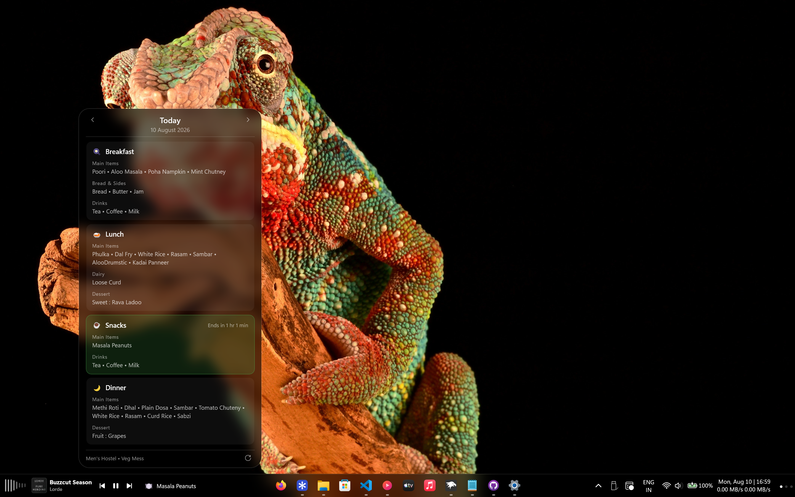
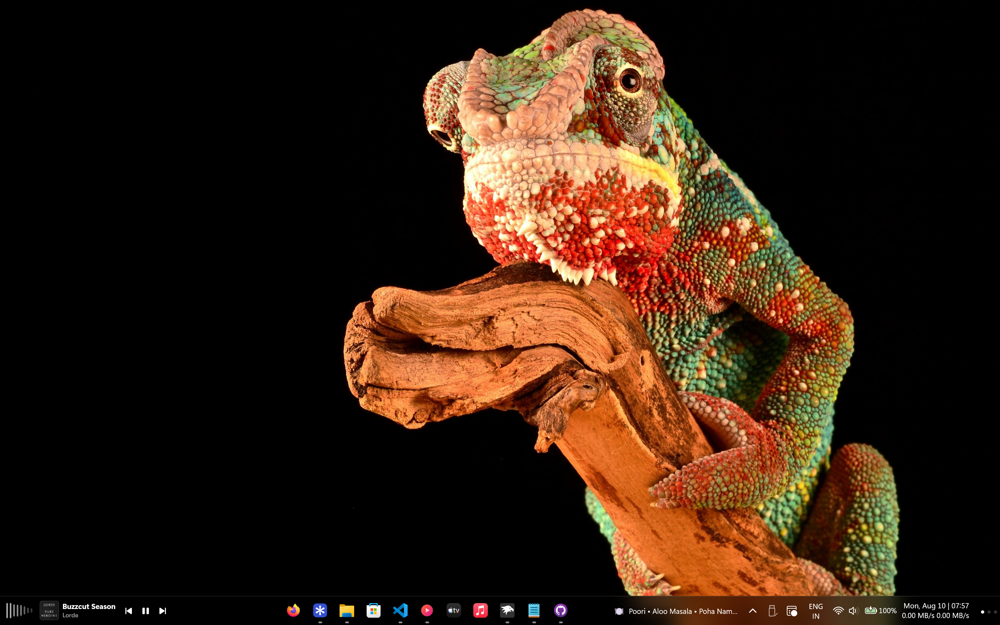
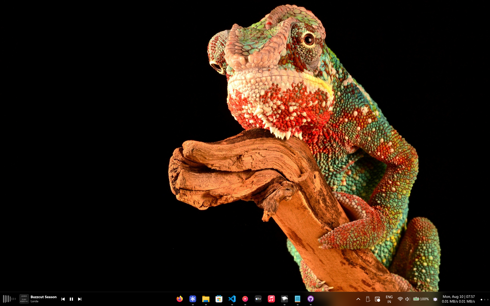
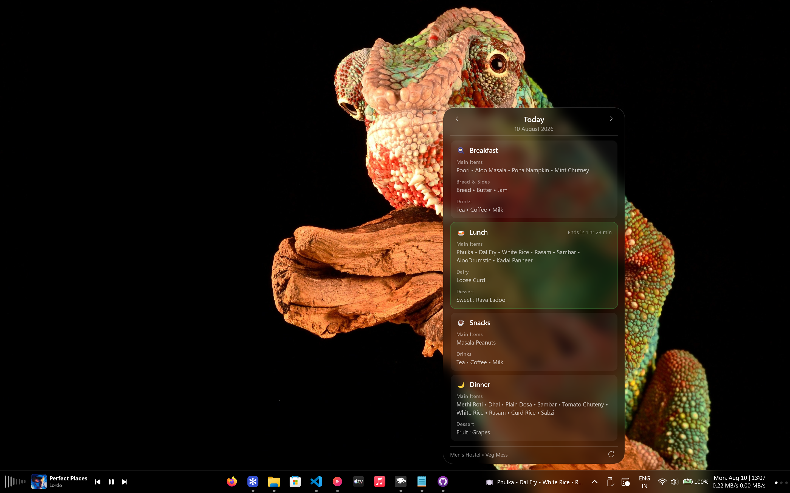
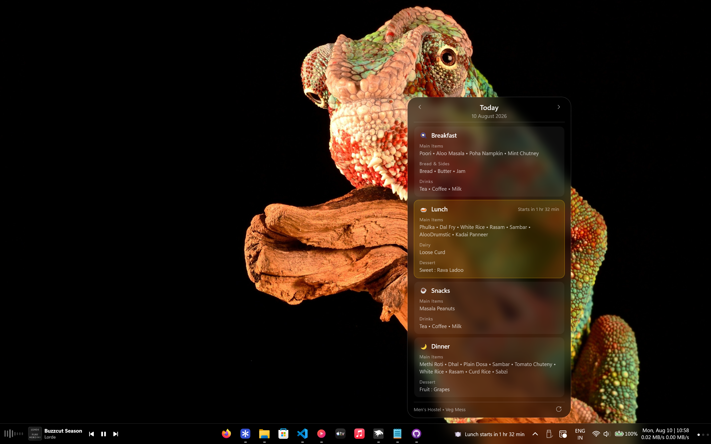
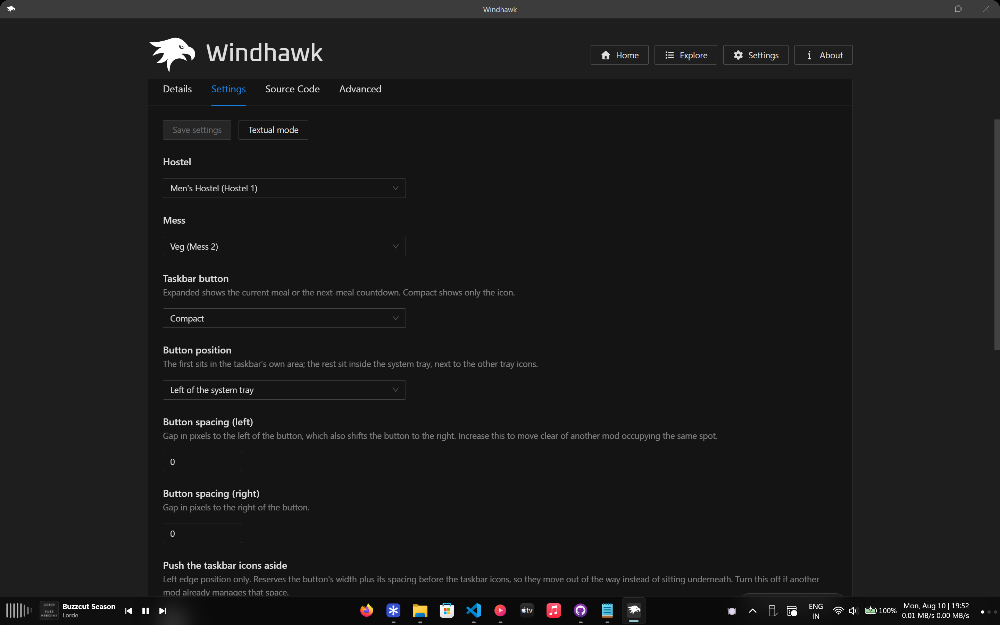

# VIT Mess Menu — Taskbar Flyout

**Your hostel mess menu, one glance away on the Windows 11 taskbar.**

[](https://windhawk.net/)
[](https://www.microsoft.com/windows/windows-11)
[](LICENSE)

A small button sits in your taskbar showing what's being served right now — or
how long until the next meal starts. Click it and a native-looking flyout slides
up with the full day's menu, grouped and ready to read. Browse to other days with
the chevrons. It caches everything locally, so it opens instantly and works
offline.

Built for **VIT Vellore**, using the menu data from
[messit.vinnovateit.com](https://messit.vinnovateit.com).



---

## ⚠️ This is a Windhawk mod, not a standalone app

There is **no `.exe` to download and no program to install.** This is a single
C++ source file that runs inside
[**Windhawk**](https://windhawk.net/), a free and open-source customisation
platform for Windows.

Windhawk compiles the mod on your machine and injects it into `explorer.exe`,
which is what lets it draw a real button into the real taskbar and open a real
XAML flyout — rather than floating a separate always-on-top window pretending to
be part of the taskbar.

**You must install Windhawk first.** See [Installation](#-installation) below.

> Because the mod runs inside Explorer, disabling or uninstalling it cleanly
> removes the button and restores the taskbar's own layout. No reboot needed.

---

## Features

### At a glance, without clicking

The taskbar button changes with the time of day:

| When | The button shows |
| --- | --- |
| During a meal | The dishes being served — `🍽 Poori • Aloo Masala • Semiya…` |
| Between meals | A live countdown — `🍽 Lunch starts in 1 hr 20 min` |
| After dinner | Tomorrow's first meal — `🍽 Breakfast starts in 10 hr` |

Prefer it out of the way? **Compact mode** shows just the icon, with the full
text in the tooltip.

### A flyout that belongs on Windows 11

- Built with the taskbar's own XAML, so it looks and behaves like the clock or
  volume flyouts — including light-dismiss, slide-up animation and theme
  awareness.
- **Matches Windows 11 automatically**, reading the acrylic tint from Explorer's
  own resources so it follows your light/dark theme.
- Or go **custom** — set any `#AARRGGBB` colour and blur radius to match a
  [Windhawk Taskbar Styler](https://windhawk.net/mods/windows-11-taskbar-styler)
  theme.

### Menus that read cleanly

Raw menu data is one long comma-separated line. The mod sorts every item into
five groups and lays them out inline.

Exactly one card is highlighted at a time, with a live countdown beside it:
green for the meal being served now, amber for the next one when nothing is
being served.

### Quietly keeps itself current

- Downloads the month's menu by itself — **nothing to import, no files to
  manage.**
- Caches to disk, so the flyout opens instantly and **works with no network**.
- Keeps up to three months cached, so browsing across a month boundary just
  works.
- **Never shows last month's food as if it were today's.** If the site hasn't
  published the new month yet, it says so and keeps checking.

### Other bits

- Browse any day with the ◀ ▶ chevrons; arrows disable at the edges of what's
  cached.
- Four button positions, plus spacing controls to sit alongside other mods.
- Optionally pushes the taskbar icons aside so nothing overlaps.
- **Multi-monitor** — put the button on the primary taskbar only, or on every
  one. The flyout opens on whichever monitor you clicked.
- **Editable meal timings** — all five serving windows are settings, so a mess
  that moves a slot doesn't need a new version of the mod.
- Hide the Snacks card if you don't use it.
- The button matches the height of Windows' own tray buttons and stays
  clickable right down to the screen edge, so you can throw the pointer at the
  corner to hit it.
- Follows light/dark theme switches without needing an Explorer restart.

---

## Screenshots

### The taskbar button

#### Taskbar button during a meal


#### Taskbar button showing the next-meal countdown


#### Taskbar button in compact mode


### The flyout

#### Flyout during a meal


#### Flyout with next meal highlighted


### Settings



---

## Requirements

| | |
| --- | --- |
| **Operating system** | Windows 11, version 22H2 or newer |
| **Windhawk** | 1.4 or newer |
| **Architecture** | x64 — which also covers ARM64 devices, where Explorer is a predefined shell process |

> **Windows 10 is not supported.** The mod hooks the XAML taskbar, which
> Windows 10 does not have. It will fail to load rather than misbehave.

> **Multi-monitor.** `Show on` chooses between the primary taskbar only (the
> default) and every taskbar. The flyout anchors to whichever taskbar you open
> it from.

> **Depends on a third-party site.** The menus come from
> `messit.vinnovateit.com`, which this mod does not control. If that site
> changes its data format or goes offline, the mod will report that no menu is
> available.

---

## Installation

### 1. Install Windhawk

Download it from **[windhawk.net](https://windhawk.net/)** and run the
installer. It's free and open-source.

### 2. Add the mod

<details>
<summary><b>Option A — from the Windhawk mod library</b></summary>

1. Open Windhawk and go to **Explore**.
2. Search for **VIT Mess Menu**.
3. Click **Install**.

</details>

<details>
<summary><b>Option B — from this repository</b></summary>

1. Download [`vit-mess-menu-taskbar.wh.cpp`](vit-mess-menu-taskbar.wh.cpp).
2. Open Windhawk → **Create Mod**.
3. Select everything in the editor and paste the file's contents over it.
4. Press **Ctrl+B** to compile, then **Ctrl+S** to save and enable.

Compiling takes a few seconds. Your taskbar will flicker once as Explorer picks
up the mod.

</details>

### 3. Pick your mess

Open the mod's **Settings** and set **Hostel** and **Mess**. That's the whole
setup — the mod works out the right file to download and fetches it in the
background.

---

## Settings

### Menu source

| Setting | Default | What it does |
| --- | --- | --- |
| **Hostel** | Men's Hostel | Men's (Hostel 1) or Women's (Hostel 2) |
| **Mess** | Veg | Special (1), Veg (2) or Non-Veg (3) |

### Taskbar button

| Setting | Default | What it does |
| --- | --- | --- |
| **Taskbar button** | Expanded | `Expanded` shows the meal or countdown; `Compact` shows only the icon |
| **Button position** | Left of the system tray | Left edge of the taskbar, left of the tray, or either side of the clock |
| **Button spacing (left)** | `4` | Gap to the left, in pixels. Also shifts the button right — raise it to clear another mod |
| **Button spacing (right)** | `4` | Gap to the right, in pixels |
| **Push the taskbar icons aside** | On | **Only does anything with "Left edge of the taskbar".** Reserves room so Windows' icons move over instead of sitting underneath. In the tray positions the tray lays the button out itself, so this has no effect |
| **Maximum label width** | `180` | Longer text is truncated with an ellipsis |
| **Show on** | The primary taskbar only | Or every taskbar, on a multi-monitor setup |

### Flyout appearance

| Setting | Default | What it does |
| --- | --- | --- |
| **Flyout width** | `380` | In pixels |
| **Flyout corner radius** | `8` | In pixels. Meal cards follow automatically, staying concentric |
| **Show the Snacks card** | On | Hide the 16:30 snack if you don't use it |
| **Flyout background** | Match Windows 11 | `Match Windows 11` follows the OS and **ignores the two settings below**. `Custom` uses them |
| **Custom background colour** | `#80000000` | `#AARRGGBB` (alpha first) or `#RRGGBB` for opaque |
| **Custom blur amount** | `18` | Blur radius in pixels; `0` gives a flat surface |

### Updates

| Setting | Default | What it does |
| --- | --- | --- |
| **Check for new menus automatically** | On | When off, the menu is only fetched via the flyout's reload button |

### Meal timings

All five serving windows are editable as `HH:MM-HH:MM`, so a mess that changes
a slot does not need a new version of the mod. The defaults are the VIT Vellore
timings listed under [How it works](#-how-it-works).

| Setting | Default |
| --- | --- |
| **Breakfast (Mon-Fri)** | `07:00-09:00` |
| **Breakfast (Sat & Sun)** | `07:30-09:30` |
| **Lunch** | `12:30-14:30` |
| **Snacks** | `16:30-18:00` |
| **Dinner** | `19:00-21:00` |

> **Matching a Taskbar Styler theme:** set **Flyout background** to `Custom`,
> then copy your theme's values across. For the *Tinted Glass* theme
> (`WindhawkBlur BlurAmount="18" TintColor="#80000000"`) the defaults already
> match — just switch the mode to `Custom`.

---

## How it works

### Meal timings

These are the defaults — VIT Vellore's timings. All five are editable in the
settings:

| Meal | Mon–Fri | Sat & Sun |
| --- | --- | --- |
| 🍳 Breakfast | 07:00 – 09:00 | 07:30 – 09:30 |
| 🍛 Lunch | 12:30 – 14:30 | 12:30 – 14:30 |
| ☕ Snacks | 16:30 – 18:00 | 16:30 – 18:00 |
| 🌙 Dinner | 19:00 – 21:00 | 19:00 – 21:00 |

### Item grouping

Every item is sorted by the first rule it matches:

| Group | Rule |
| --- | --- |
| **Dessert** | Starts with `Sweet:`, `Sweets:`, `Fruit:`, `Fruits:` or `Dessert:` — with or without a space before the colon — or contains *ice cream* |
| **Dairy** | Exactly `Curd`, `Loose Curd`, `Thick Curd` or `Butter Milk` |
| **Drinks** | Ends in *tea*, *coffee*, *milk*, *sharbat*, *juice*, *lassi* or *shake* |
| **Bread & Sides** | Exactly `Bread`, `Butter` or `Jam` |
| **Main Items** | Everything else |

Matching is on whole items and final words, never substrings — so *Curd Rice*
stays a main dish while *Cold Badam Milk* correctly becomes a drink.

### Data and caching

Menus come from:

```
https://messit.vinnovateit.com/menu-data/hostel-{hostel}-mess-{mess}.json
```

Each file covers one month. Cached copies live in Windhawk's own storage folder
for this mod, which **Windhawk deletes when the mod is removed** — so the mod
leaves nothing behind on your disk.

- If the current month is already cached, **nothing is downloaded**.
- If it's missing, the mod retries every 6 hours, backing off from 15 minutes on
  network errors.
- Up to three months are kept, so day-navigation crosses month boundaries.
- The reload button at the bottom of the flyout forces a check immediately.

---

## Troubleshooting

<details>
<summary><b>The button doesn't appear</b></summary>

Check the Windhawk log (**Mods → this mod → Log**).

- `taskbar symbol hooks failed` — Windows updated and the taskbar's internals
  moved. Please [open an issue](../../issues) with your Windows build number
  (`winver`).

</details>

<details>
<summary><b>It says "Menu data not available for this month"</b></summary>

The site hasn't published the new month's file yet. The mod checks every few
hours and will pick it up automatically — or press the reload button in the
flyout to check right away.

This is deliberate: the mod will never show last month's menu as if it were
current.

</details>

<details>
<summary><b>The button doesn't appear on my second monitor</b></summary>

Set **Show on** to *Every taskbar* — the default is the primary taskbar only.

If it still doesn't appear, check the Windhawk log:

- `GetTaskbarXamlRoot: CSecondaryTaskBand symbols not resolved` — your Windows
  build doesn't expose the symbols secondary taskbars need. The primary taskbar
  keeps working; this is why they're resolved as optional.
- `GetTaskbarXamlRoot: taskband window not found` — the secondary taskbar's
  internals aren't laid out as expected. Please
  [open an issue](../../issues) with your build number (`winver`).

</details>

<details>
<summary><b>The button overlaps another mod</b></summary>

The mod can't see other mods' elements, so it can't route around them
automatically. Raise **Button spacing (left)** to slide it clear, or pick a
different **Button position**.

</details>

<details>
<summary><b>The flyout has no blur</b></summary>

Check that **Transparency effects** are on in Windows Settings →
Personalisation → Colours. If they're off, Windows disables composition blur
system-wide and the flyout falls back to a solid surface.

</details>

<details>
<summary><b>The menu looks wrong or out of date</b></summary>

Press the reload button in the flyout. If that doesn't help, remove the mod in
Windhawk and add it again — that clears the cached menus, so the next check
downloads from scratch.

</details>

---

## Building

The mod is a single self-contained C++ file — no build system, no dependencies
to fetch. Windhawk compiles it for you when you press **Ctrl+B** in its editor.

To check it compiles outside Windhawk, using Windhawk's own bundled toolchain:

```powershell
& "C:\Program Files\Windhawk\Compiler\bin\clang++.exe" `
  "@C:\Program Files\Windhawk\Compiler\compile_flags.txt" `
  -Wall -fsyntax-only vit-mess-menu-taskbar.wh.cpp
```

<details>
<summary>Technical notes</summary>

- **C++23**, compiled by Windhawk's bundled clang targeting `x86_64-w64-mingw32`.
- **UI:** C++/WinRT over the system XAML (`Windows.UI.Xaml`) that Explorer's
  taskbar already hosts — not WinUI 3.
- **Networking:** WinHTTP on a dedicated worker thread.
- **JSON:** `Windows.Data.Json`, so there's no vendored third-party parser.
- **Blur:** a Composition effect graph (`CreateBackdropBrush` →
  `D2D1GaussianBlur`) exposed as a `XamlCompositionBrushBase`.
- **Multi-monitor:** the `CSecondaryTaskBand` symbols are resolved as *optional*
  hooks, so a build without them loses only secondary taskbars rather than
  failing to load.

</details>

---

## Changelog

### 1.0.0

First release.

- Taskbar button showing the current meal, or a countdown to the next one.
- Native XAML flyout with all four meals, day navigation and a reload button.
- Automatic grouping into Main Items, Bread & Sides, Dairy, Drinks and Dessert.
- Offline-first caching in Windhawk's per-mod storage, up to three months.
- Four button positions, adjustable spacing, and optional space reservation so
  the taskbar's own icons move aside.
- **Multi-monitor:** primary taskbar only, or every taskbar.
- **Editable meal timings** — all five serving windows.
- Flyout appearance: width, corner radius (meal cards stay concentric), and
  either Windows 11's own acrylic tint or a custom `#AARRGGBB` colour with an
  adjustable blur radius.
- Follows light/dark theme switches live.

---

## Credits

- **[Windhawk](https://windhawk.net/)** by Ramen Software — the platform that
  makes this possible.
- **[messit.vinnovateit.com](https://messit.vinnovateit.com)** by
  [VinnovateIT](https://vinnovateit.com/) — the menu data this mod reads.
- **[Taskbar Fluent Media Player](https://windhawk.net/mods/taskbar-fluent-media-player)**
  by Salyts, and **[Taskbar AI Quota](https://windhawk.net/mods/taskbar-ai-quota)**
  — the references for reaching the taskbar's XAML root through
  `CTaskBand::GetTaskbarHost` and the `TaskbarHost::FrameHeight` prologue, the
  system-tray column insert/remove, and the `RunFromWindowThread` helper.
  Both are MIT licensed.
- **[Windows 11 Taskbar Styler](https://windhawk.net/mods/windows-11-taskbar-styler)**
  — the Composition backdrop-blur brush. **GPL-3.0**, and its `XamlBlurBrush` is
  itself derived from [TranslucentTB](https://github.com/TranslucentTB/TranslucentTB),
  also GPL-3.0. This mod's blur is derived from it, which is why the licence
  below is GPL-3.0.

---

## License

**GPL-3.0** — see [LICENSE](LICENSE).

The blur implementation is derived from Windows 11 Taskbar Styler (GPL-3.0), so
this mod is GPL-3.0 as a whole rather than MIT.

---

## Disclaimer

An unofficial, community-built tool. Not affiliated with or endorsed by VIT,
VinnovateIT, Microsoft or Ramen Software. Menu data is fetched as-is from a
third-party site; **always check the mess notice board for the final word.**
